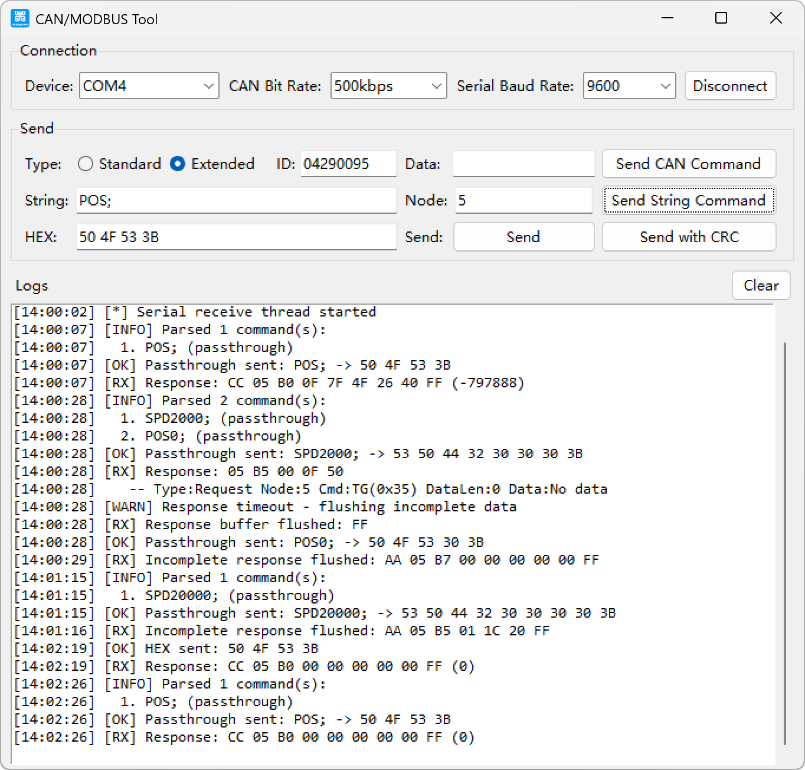

# CAN/MODBUS Tool

A Python-based GUI tool for CAN bus and MODBUS communication with USB-CAN adapters.

[](https://www.adampower.de/stepper-motor-controller/canbus-stepper-motor-controller)



## Features

- **Dual Protocol Support**: CAN bus (AA...55 format) and MODBUS (CC...FF format)
- **Multiple Input Formats**: HEX (continuous/space/comma separated), String commands, CAN frames
- **Automatic Parsing**: 3-byte (16-bit signed) and 5-byte (32-bit signed) data parsing
- **Cross-Platform**: Windows, Linux, macOS
- **User-Friendly GUI**: Tkinter-based interface with real-time logging

## Supported Devices

- **CANALYST2** - Native CAN devices via ControlCAN.dll
- **USB-CAN Adapters** - CH340/CH341 based serial gateway mode
- **UIM342** - [CANBUS Stepper Motor Controller](https://www.adampower.de/stepper-motor-controller/canbus-stepper-motor-controller)

## Requirements

### Runtime
- Python 3.8+ (for source execution)
- Windows/Linux/macOS

### Dependencies
```
pyserial>=3.5
tkinter (usually included with Python)
```

### For CAN Device Support
- ControlCAN.dll (included in releases)

## Installation

### Option 1: Pre-built Executable (Recommended)

Download the latest release from [Releases page](https://github.com/yourusername/USB-CAN/releases).

```bash
# Windows
CAN_Tool.exe

# Make executable (Linux/macOS)
chmod +x CAN_Tool
./CAN_Tool
```

### Option 2: From Source

```bash
# Clone repository
git clone https://github.com/yourusername/USB-CAN.git
cd USB-CAN

# Install dependencies
pip install -r requirements.txt

# Run
python main.py
```

## Usage

### Connecting

1. Select device type from dropdown (CAN0 for CANALYST2, or serial port for USB-CAN)
2. Configure baud rates (CAN and Serial)
3. Click **Connect**

### Sending Commands

#### UIM342 String Commands
Format: `CMD1;CMD2;CMD3;`

Examples:
```
SP1000;BG;          # Set speed and begin motion
ML;                 # Get model
PA60000;            # Set absolute position
```

#### HEX Data
Supports multiple formats:
```
010300000001        # Continuous (MODBUS)
01 03 00 00 00 01   # Space separated
01,03,00,00,00,01   # Comma separated
```

Options:
- **Send**: Raw HEX without CRC
- **Send with CRC**: HEX + MODBUS CRC16

#### CAN Frames
- Select Standard (11-bit) or Extended (29-bit) frame
- Enter ID in HEX
- Enter data bytes in HEX

### Response Parsing

The tool automatically parses responses:

#### 3-Byte Data (16-bit signed)
Format: `CC [header] [3 bytes] FF`

Example: `CC 05 B2 7E 63 60 FF` → -20000

#### 5-Byte Data (32-bit signed)
Format: `CC [header] [5 bytes] FF`

Example: `CC 05 B0 0F 7F 58 78 00 FF` → -640000

## Command Reference

### Motion Control
| Command | Description | Example |
|---------|-------------|---------|
| `BG` | Begin motion | `BG;` |
| `ST` | Stop motion | `ST;` |
| `OG` | Set origin | `OG;` |
| `PA[n]` | Position absolute | `PA60000;` |
| `PR[n]` | Position relative | `PR-400;` |
| `JV[n]` | Jog velocity | `JV1000;` |
| `SP[n]` | PTP speed | `SP1000;` |

### System
| Command | Description | Example |
|---------|-------------|---------|
| `ML` | Get model | `ML;` |
| `SN` | Get serial number | `SN;` |
| `ER` | Error report | `ER;` |
| `MO[n]` | Motor on/off (0/1) | `MO1;` |

## Building from Source

### Development Setup

```bash
# Create virtual environment
python -m venv venv
source venv/bin/activate  # Linux/macOS
# or
venv\Scripts\activate  # Windows

# Install dependencies
pip install pyserial pyinstaller
```

### Packaging

```bash
# Single executable with all dependencies
pyinstaller --onefile --windowed --icon=logo.ico --add-data="logo.ico;." --add-data="ControlCAN.dll;." --name="CAN_Tool" main.py
```

Output: `dist/CAN_Tool.exe`

## Project Structure

```
USB-CAN/
├── main.py                 # Main application
├── string_commands.py      # String command parser
├── send.py                 # CAN send example
├── receive.py              # CAN receive example
├── sdk_functions.py        # SDK function wrappers
├── parsers.py              # Data parsers
├── constants.py            # Constants
├── ControlCAN.dll          # CAN device driver
├── logo.ico                # Application icon
├── README.md               # This file
└── requirements.txt        # Python dependencies
```

## Technical Details

### Protocol Formats

#### CAN Gateway Frame (AA...55)
```
[0xAA] [CTRL] [ID...] [DATA...] [0x55]
```

#### UIMessage Frame (CC...FF)
```
[0xCC] [ID] [CTRL] [DATA...] [CRC16] [0xFF]
```

#### MODBUS Response
```
[ID] [CTRL] [LEN] [DATA...] [CRC16]
```

### Data Parsing

#### 3-Byte (16-bit signed)
```
Byte0[1:0] → D15:D14
Byte1[6:0] → D13:D7
Byte2[6:0] → D6:D0
Bit7 in each byte = padding (ignored)
```

#### 5-Byte (32-bit signed)
```
Byte0[3:0] → D31:D28 (4 bits)
Byte1[6:0] → D27:D21
Byte2[6:0] → D20:D14
Byte3[6:0] → D13:D7
Byte4[6:0] → D6:D0
Bit7 in each byte = padding (ignored)
```

## Troubleshooting

### Common Issues

1. **"Device may be occupied"**: Close other CAN applications
2. **"Invalid hex value"**: Check HEX format (even number of characters)
3. **No response**: Verify baud rate and connection settings
4. **CRC errors**: Check cable connections and termination

### Debug Mode

Run with logging enabled:
```bash
python main.py  # Logs saved to can_tool.log
```

## License

This project is provided as-is for educational and development purposes.

## Links

- **Official Website**: [https://www.adampower.de/stepper-motor-controller/canbus-stepper-motor-controller](https://www.adampower.de/stepper-motor-controller/canbus-stepper-motor-controller)
- **Device Manual**: UIM342_V4.10.pdf (included)

## Changelog

### v1.0.0
- Initial release
- CAN bus and MODBUS support
- 3-byte and 5-byte signed data parsing
- Pre-built executable with ControlCAN.dll
